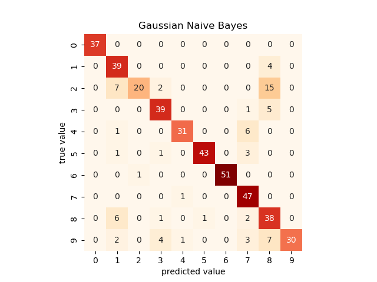
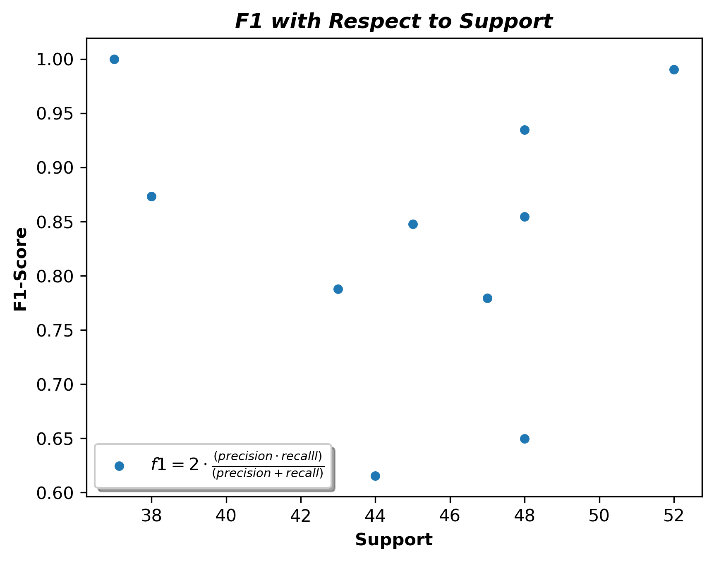
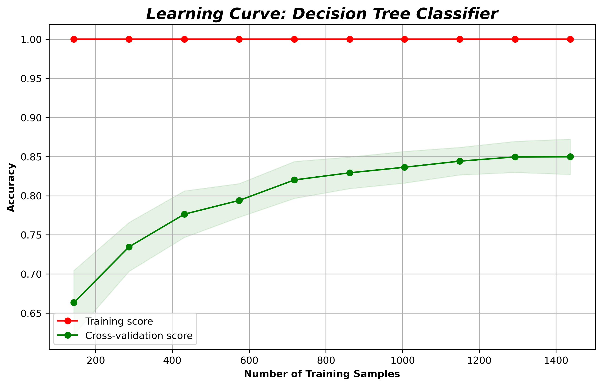
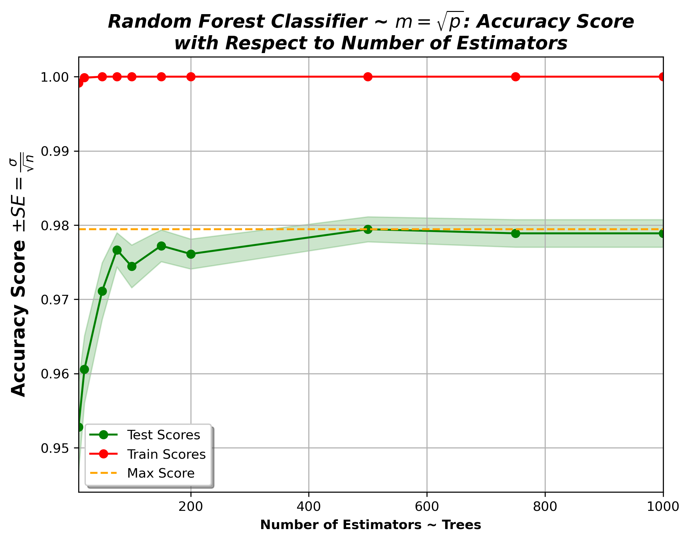
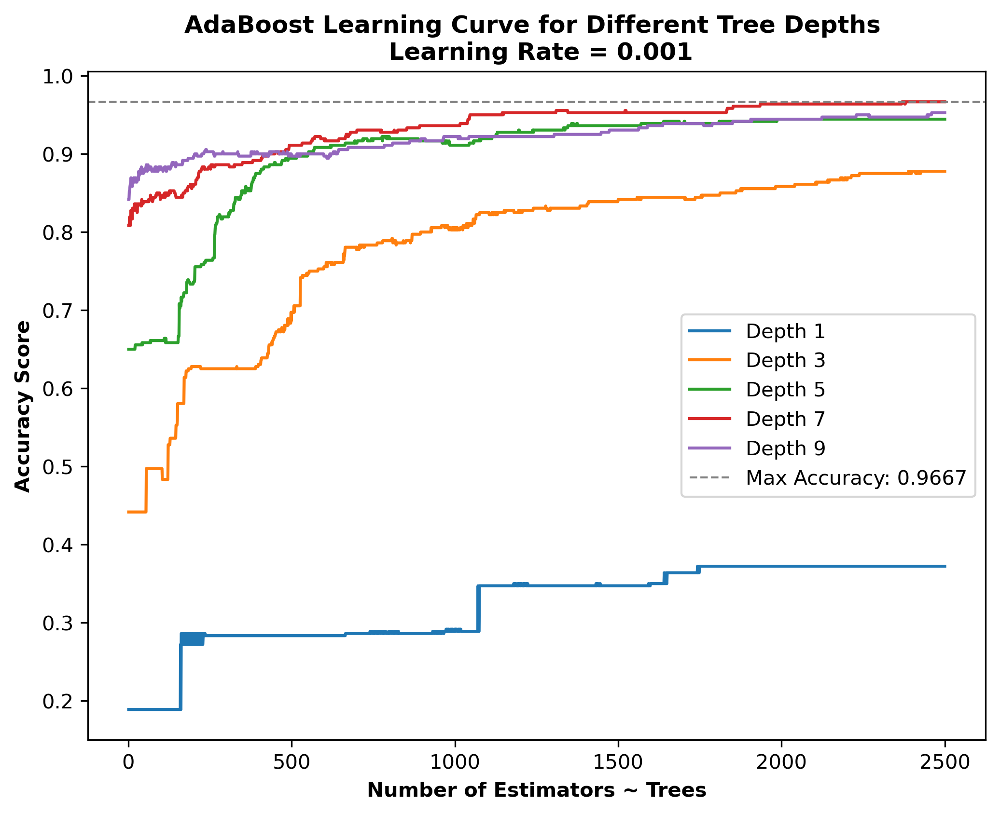
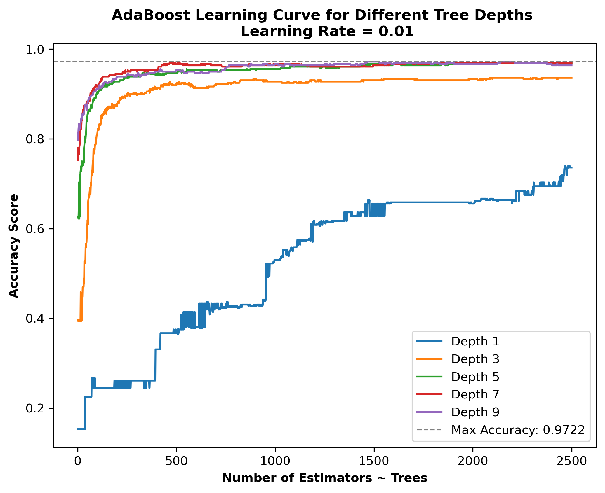
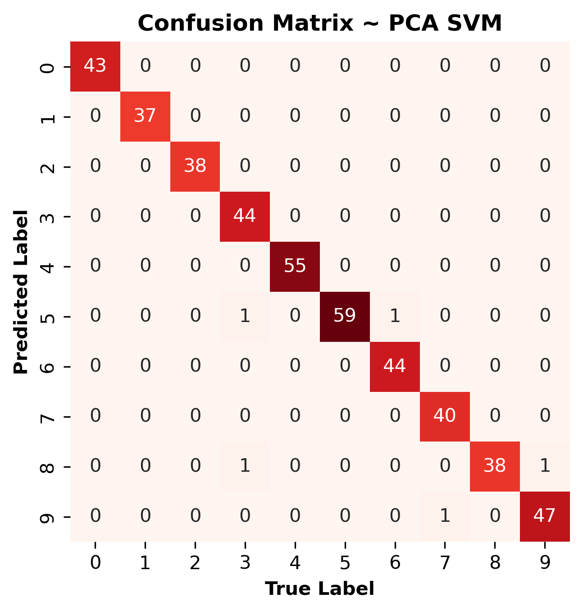

# hw-digits
### Step 1: Check ```requirements.yml```
If you have all the required packages proceed to step 2, otherwise create a virtual environment with one of the the following commands.

This command will create a conda generated virtual environment
```
make init
```
This command will create a manually generated virtual environment
```
make man_gen_env
```
### Step 2: Create ```figs``` directory
This command will create a ```figs``` folder if it does not already exist.
```
make create_directory
```
___

### Learning goals
___

* Practice with scikit-learn API using the digits dataset
* Unbalanced data, validation curves, hyperparameter tuning and model selection with cross validation
* Comparison of various classification methods (decision tree, random forest, adaboost, SVC)

### Instructions

This assignment builds on
[05.02 - Introducing Scikit-Learn](https://github.com/jakevdp/PythonDataScienceHandbook/blob/master/notebooks/05.02-Introducing-Scikit-Learn.ipynb) by VanderPlas, which produces train/test accuracy of 0.86/0.83 for Gaussian Naive Bayes
classification of the digits dataset.
You can reproduce those results with
```
make template
```
which prints the train/test accuracy:
```
Train accuracy: 0.86
Test accuracy: 0.83
```
and plots the confusion matrix:



___

### Step 3: Question 1
___

Use the [classification_report](https://scikit-learn.org/stable/modules/generated/sklearn.metrics.classification_report.html) to investigate performance by class.
Describe the source of variation in the "support" column.
Is the variation problematic? Justify your assessment quantitatively.
Explain your conclusions in a maximum of 1 or 2 sentences maximum.

To reproduce the following results and figures execute this command:
```
make q1
```
This is the classification report for Naive Bayes classification model:
```
              precision    recall  f1-score   support

           0       1.00      1.00      1.00        37
           1       0.70      0.91      0.79        43
           2       0.95      0.45      0.62        44
           3       0.83      0.87      0.85        45
           4       0.94      0.82      0.87        38
           5       0.98      0.90      0.93        48
           6       1.00      0.98      0.99        52
           7       0.76      0.98      0.85        48
           8       0.55      0.79      0.65        48
           9       1.00      0.64      0.78        47

    accuracy                           0.83       450
   macro avg       0.87      0.83      0.83       450
weighted avg       0.87      0.83      0.83       450
```
This report demonstrates that the model performed considerably better with some of the digits than others. Most notably, $2$ and $8$ performed poorly with an ```f1-score``` of $0.62$ and $0.65$, respectively.

The ```support``` column displays the number of actual occurances of each class in the testing data. Therefore, the source of the variation in the ```support``` column is related to the make up of the testing dataset itself.

Is ```support``` impacting model performance? 

The coefficient of variation of the ```support``` column is:
```
The coefficient of variation of the support column is: 9.89%.
```
The coefficient of variation is numerical unitless measure of variability of a sample with respect to the mean, it is computed as follows:

$$ CV = \frac{\sigma}{\mu} \cdot 100$$

The CV in this instance is not considerably high.



This figure displays the ```f1-score``` with respect to ```support```. It does not indicate a strong relationship.

Considering CV and the scatterplot I would surmise ```support``` is not impacting model performance.

___

### Step 4: Question 2
___

Use a decision tree classifier with the same data.
Investigate model performance with a validation curve.
Comment briefly (1 or 2 sentences, maximum) on the results, including a comparison with the results from Question 1.

To reproduce the following figure execute this command:
```
make q2
```


This figure demonstrates that the model does not perform particularly well. The test accuracy score maxes out with mean of $\approx 0.85$ when roughly $90\%$ of data is used in training. This is a similar result to the Naive Bayes model performed in Q1.

___

### Step 5: Question 3
___

In [5.08 Random Forests](https://github.com/jakevdp/PythonDataScienceHandbook/blob/master/notebooks/05.08-Random-Forests.ipynb), VanderPlas performs digits classification with a random forest.
He uses `n_estimators=1000`.
Use a validation curve to investigate the choice of n_estimators.
Comment briefly on the results (including comparison with results above).

To reproduce the following figure execute this command:
```
make q3
```


This figure displays the training and testing scores of a Random Forest Classifier with respect to the number estimators. The number of estimators is the number of decision trees in the forest. VanderPlas uses ```n_estimators``` $= 1000$. This figure demonstrates that using $1000$ trees is unnecessary; the mean accuracy does not dramatically improve above $\approx 100$ estimators. At which point the max score is essentially within the standard error of the mean. In relation to the Naive Bayes and Decision Tree models, the Random Forest model performs considerably better.

___

### Step 6: Question 4
___

Investigate use of
[AdaBoost](https://scikit-learn.org/stable/modules/generated/sklearn.ensemble.AdaBoostClassifier.html).
Boosting is discussed in Section 8.2.2 (p345) of ISLR.
Look at the scikit-learn
[adaboost example](https://scikit-learn.org/stable/auto_examples/ensemble/plot_adaboost_hastie_10_2.html) for ideas.
Comment briefly on results and your choice of hyperparameters (including comparison with results above).

To reproduce the following the figures execute this command:

**Note: This can take a few minutes to run**
```
make q4
```





The above figures demonstrate the performance of the ```AdaBoostClassier``` over ranges of the $3$ hyperparameters, ```depth```, ```n_estimators```, and ```learning_rate```.

As demonstrated, parameterizing the model with a ```learning rate``` of $0.01$ generally outperforms $0.001$, in this instance.

Overall, the maximum ```accuracy score``` is obtained by parameterizing the model with: ```learning rate``` $= .01$, ```n_estimators``` $\approx 500$, and ```depth``` $= 7$.

The max accuracy score obtained is $\approx 0.97$. This is a similar result to the RandomForest and better than the previos two.

___

### Step 7: Question 5
___

Adapt the use of SVC in cells 18-26 of
[Labeled Faces in the Wild demo in VanderPlas](https://github.com/jakevdp/PythonDataScienceHandbook/blob/master/notebooks/05.07-Support-Vector-Machines.ipynb).
When selecting optimal hyperparameters, make sure that your range encompasses the
best value.
Comment briefly on results and your choice of hyperparameters (including comparison with results above).

To execute the GridSearch and reproduce the following results execute this command:

**NOTE: THIS WILL TAKE ~ 30 MINUTES TO EXECUTE**

Alternatively, ```make 5b``` will directly instantiate the model using the discovered optimal hyperparameters and reproduce the same results rapidly. These next results are produced from ```q5.py```, which execute the ```GRIDSEARCH``` and then execute the model. The next section will show the results from ```q5b.py```, which **only** execute the model. The results are naturally, the same.
```
make q5
```
This file executes $1536$ models over various values of the hyperparameters of the PCA and SVC to find the best model.

The ranges of hyperparamters examined are:

* **PCA**: 
  * ```n_components```: $\{1,2,\dots,64\}$
* **SVC**:
    * ```kernel```: $\{rbf, poly\}$
    * ```C```: $\{1, 10, 50\}$
    * ```gamma```: $\{.0001, .0005, .001, 0.005\}$

The output of ```best_params_``` is:
```
{'pca__n_components': 34, 'svc__C': 10, 'svc__gamma': 0.005, 'svc__kernel': 'rbf'}
```
After instantiating the model: ```model = grid.best_estimator_``` the accuracy score is:
```
The accuracy score of the best model is: 0.9889.
```
The classification report is:
```
              precision    recall  f1-score   support

           0       1.00      1.00      1.00        43
           1       1.00      1.00      1.00        37
           2       1.00      1.00      1.00        38
           3       1.00      0.96      0.98        46
           4       1.00      1.00      1.00        55
           5       0.97      1.00      0.98        59
           6       1.00      0.98      0.99        45
           7       1.00      0.98      0.99        41
           8       0.95      1.00      0.97        38
           9       0.98      0.98      0.98        48

    accuracy                           0.99       450
   macro avg       0.99      0.99      0.99       450
weighted avg       0.99      0.99      0.99       450
```
And lastly, the confusion matrix:



To reproduce the results using ```q5b.py```, where the model is directly instantiated, execute this command:
```
make q5b
```
Accuracy Score:
```
The accuracy score of the best model is: 0.9889.
```
Summary Report:
```
 precision    recall  f1-score   support

           0       1.00      1.00      1.00        43
           1       1.00      1.00      1.00        37
           2       1.00      1.00      1.00        38
           3       1.00      0.96      0.98        46
           4       1.00      1.00      1.00        55
           5       0.97      1.00      0.98        59
           6       1.00      0.98      0.99        45
           7       1.00      0.98      0.99        41
           8       0.95      1.00      0.97        38
           9       0.98      0.98      0.98        48

    accuracy                           0.99       450
   macro avg       0.99      0.99      0.99       450
weighted avg       0.99      0.99      0.99       450
```
Confusion Matrix:


The choice of hyperparameters was made using the discussed ```GridSearch```. The optimal model performed very well, with the hightest accuracy score of all the models examined. 

___

## Step 8: Clean
This command will remove the virutal environment (if you created one).
```
make clean
```


